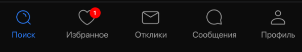
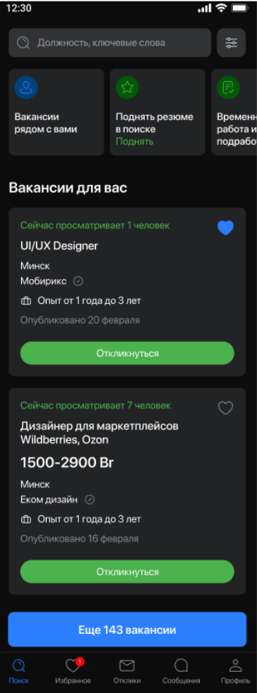
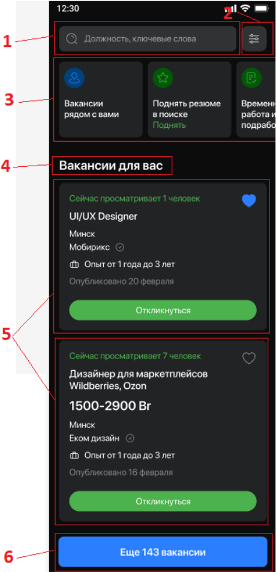
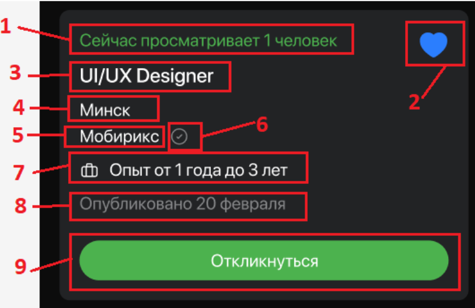
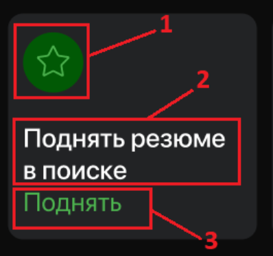
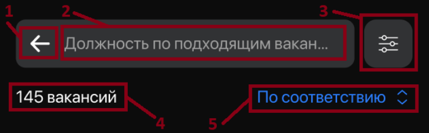
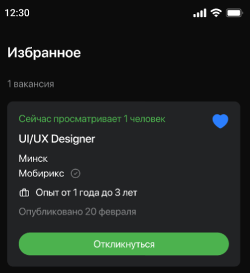
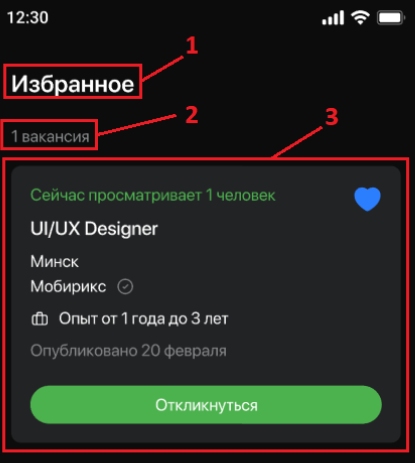

# Задание
## Рекомендуемый стек технологий
* Kotlin 
* Корутины (но если на RX сможете, тоже отлично)
* Flow или LiveData или RX 
* Dagger или Koin
* MVVM
* AdapterDelegates
* Верстка обычная на XML
* Clean Architecture
* Многомодульность (обязательно)
* Room (не обязательно, если время будет)
* Retrofit(либо другая библиотека для работы с сетью)

## 1. Меню
  
Независимо от выбранного экрана в приложении отображается меню. Оно включает фиксированный набор кнопок. В очередности отображения слева направо:
1. Поиск - переход к главному экрану (см. раздел 2)
2. Избранное - переход в раздел избранного (см. раздел 3) Если есть вакансии, добавленные в избранное, то на иконке пункта меню отображается красный бабл со значение числа добавленных в избранное объектов. Если таких объектов нет, то бабл не отображается.
3. Отклики - переход к экрану с заглушкой.
4. Сообщения - переход к экрану с заглушкой.
5. Профиль - переход к экрану с заглушкой.

## 2. Экран “Главная”
Экран не имеет заголовка. Для отображения экрана используется JSON (ответ сервера).

### 2.1 Основной главный экран

  
  

1. Поле для поиска. В поле отображается хардкодные иконка  и текст “Должность, ключевые слова” в качестве подсказки. Нефункциональный элемент.
2. иконка кнопки фильтра. Нефункциональный элемент.
3. Блок рекомендаций. Данные берутся из массива offers. Один объект соответствует одной отображаемой карточке. Число отображаемых объектов зависит от размерности массива offers. Блок отображается в виде ленты, элементы которой можно свайпать (пролистывать).
Если offers пустой, то блок не отображается.
4. хардкодный заголовок “Вакансии для вас”. Под ним отображаются вакансии (объекты) из массива vacancies. 
5. вакансии из массива vacancies. По умолчанию отображаются первые 3 объекта этого массива.
6. кнопка с текстом “Еще {число вакансий} вакансии”, где
{число вакансий} - число, равное число объектов массива vacancies,
слово “вакансии” склоняется в зависимости значения {число вакансий}
Кнопка отображается после 3-й вакансии из vacancies. При клике на кнопку на экране отображаются все объекты из vacancies и меняется вид верхней части экрана (описано в разделе 2.2).

#### Блок с вакансией
  

При клике на любую часть карточки, кроме зоны кнопки “Откликнуться”, осуществляется переход к странице вакансии - заглушка.

1. сколько просматривает человек. Текст отображается только в том случае, если пришло поле lookingNumber. Значение формируется так: “Сейчас просматривает {lookingNumber} человек”. Для слова человек учесть склонение в зависимости от lookingNumber.
2. признак добавления в избранное. Если isFavorite=false, отображается пустая иконка . Если isFavorite=true, то отображается залитая иконка . 
Элемент доступен для для взаимодействия. При клике вакансия добавляется в избранное или удаляется. Данные сохраняются в локальной БД. Добавленные элементы можно посмотреть в разделе “Избранное” (см. раздел 2).
3. Заголовок. Берется значение из поля title.
4. город. Берется значение из поля address.town
5. название компании. Берется значение из поля company.
6. иконка проверенности компании. Хардкод, есть у каждой компании.
7. опыт. Иконка портфеля - хардкод. Рядом с ней текст из поля experience.previewText.
8. дата публикации вакансии. Значение из поля publishedDate. Формат: “Опубликовано “ + “{день}” + “{месяц}”. Постараться учесть склонение месяца в зависимости от дня.
9. кнопка отклика. Текст “Откликнуться” - хардкод. Нефункциональный элемент.
 
 #### Блок рекомендации
   

Вся карточка кликабельна. При клике переход по ссылке из поля link.

1. Иконка. Хардкод в завязке на идентификатор рекомендации (см. таблицу ниже). Если идентификатор отсутствует, то иконка не отображается.
2. заголовок. Берется из title. Может отображаться в 3 строки, если объект button отсутствует. Если текст длиннее 3-х строк, то обрезается по пробелу. Если объект button есть, то отображение происходит аналогично, но только в 2 строки, т.к. в третьей строки будет значение из button.text.
3. выделенный текст. Отображается зеленым цветом согласно макету, если пришло значение button.text. Иначе не отображается.

|id | Иконка  |
|----|-----|
| near_vacancies |  |
| level_up_resume |  |
| temporary_job |  |

### 2.2 Вакансии по соответствию

1. иконка “назад”. По клику выполняется переход на предыдущее состояние экрана (см. раздел 2.1). Харкод.
2. После поиска. В поле отображается хардкодный текст с подсказкой, согласно макету. Поле нефункциональное.
3. иконка кнопки фильтра. Нефункциональный элемент.
4. число вакансий. Отображается в формате: “{число объектов массива vacancies}” + “ вакансий”. Последнее слово должно склоняться в зависимости от числа вакансий.
5. доп. фильтр. Нефункциональный элемент. Отображается согласно макету.

## 3. Экран “Избранное”
Для отображения экрана используется JSON (ответ сервера).

  
  

1. Заголовок экрана. Значение: “Избранное”. Хардкод.
2. число добавленных вакансий. Вид: “{число добавленных в избранное объектов} ” + “вакансия”, где “вакансия” должно склоняться в зависимости от числа.
3. карточка вакансии. Логика ее отображения описана в разделе 2.1.
